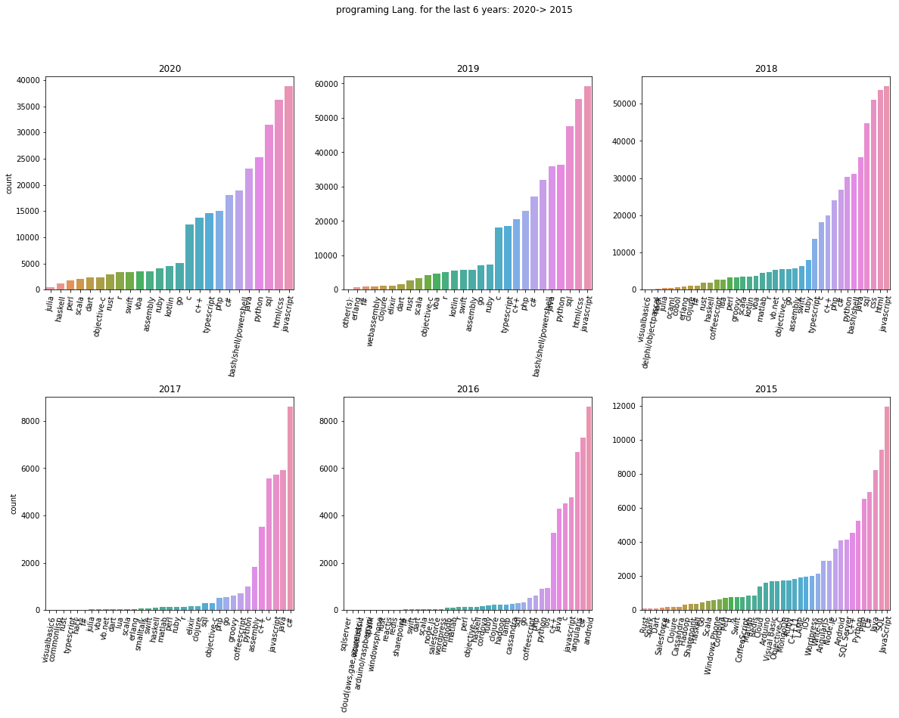
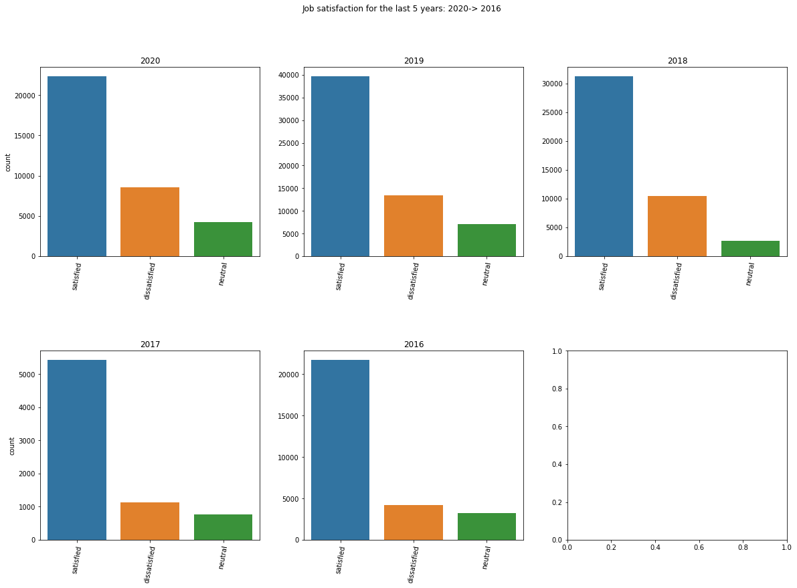
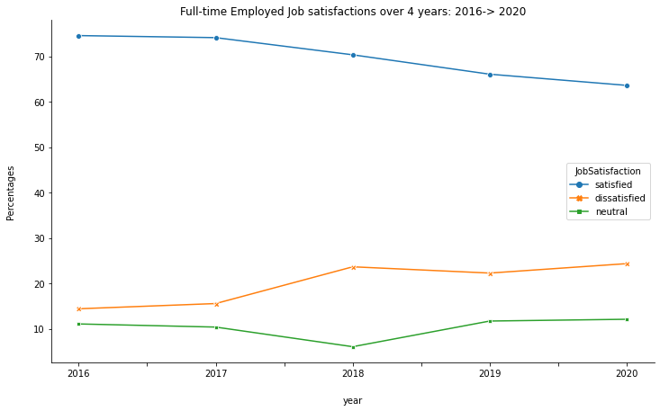

# Stack Overflow surveys

Stack Overflow conducted surveys over the years with respondents using their website, many attributes were collected and stored in csv files. This project aims at conducting a light exploratory data analysis by consolidating data over the years and answer some predefined questions.

At first it will be interesting to explore which Programming languages were the most trending, secondly Job satisfaction categories will be explored and satisfied employees counts' trend over the years will be checked for a significant variation.

csv surveys files (2015 -> 2020) were used to conduct this EDA, uploaded in the repository with various attributes related to respondents using Stack Overflow (e.g. age, current job, experience, job satisfaction, preferences, hobbyist programmer or not, etc.). Furthermore 3 Jupyter Notebooks were uploaded, with the commit description of each file purpose.

## Questions

#### Question 1
What were the most used programming languages over the years?

Over the last 5 years, JavaScript was undoubtedly the mostly used programming language according to respondents' answers in the surveys.
The bar plots visualization below also show a trend following the #1 language; it can be observed that CSS and html programming languages have been trending over the last 3 years as well.

___

#### Question 2
How did the Job satisfaction varied over time for full-time employees using Stack Overflow?

The bar plots below, although the discrepancies and differences in sample sizes, show a large number of satisfied employees at their companies. Nevertheless, it will be more beneficial to standardize the number of that categories and compute proportions to have a better idea of any changes over the years.

___
#### Question 3

Does satisfaction of full-time employed Stack Overflow respondents varies over the years? does it increase or decrease? is the change statistically significant?

the answer to those questions, lies first in understanding that differences in sample size from year to year should be standardized (proportions computation). Afterward, the various categories of job satisfactions are plotted over the years to visually inspect the line plots. Finally, a chi square test is conducted to determine whether the satisfaction varies over the years? And if it does. is the change in proportions statistically significant?

After conducting the chi-square test for the different proportions over the years of satisfied full time employee, it was conducted that the decrease is not significant statistically with a p value of 0.8. Which makes us conclude that Job satisfaction is considered steady over the years more or less, but not increasing.
___
## Project's Tools & resources
Juptyer, Gitbash/Github, Atom text editor, Python libraries: Numpy, Pandas, Re, Matplotlib, Seaborn, Scipy

[Stack Overflow data](https://insights.stackoverflow.com/survey)
